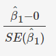

# Building a Simple Linear Regression model

Dataset can be downloaded from below:

[Advertising Dataset](advertising.csv)

## Step 1 : Reading and Understanding the Data

Before building a linear regression model, let's first understand and visualise the dataset.

[Reading and Understanding Data](step1/ReadingAndUnderstandingData.ipynb)

## Step 2 : Hypothesis Testing in Linear Regression

Before you move on to the model building part, there is still one theoretical aspect left to be addressed - the significance of the derived beta coefficient. When you fit a straight line through the data, you'll obviously get the two parameters of the straight line, i.e. the intercept (β0) and the slope (β1). Now, while β0 is not of much importance right now, but there are a few aspects surrounding β1 which need to be checked and verified.

The first question we ask is, "Is the beta coefficient significant?" What does this mean?
Suppose you have a dataset for which the scatter plot looks like the following:

Now, if you run a linear regression on this dataset in Python, Python will fit a line on the data which, say, looks like the following:

Now, you can clearly see that the data is randomly scattered and doesn't seem to follow a linear trend or any trend, in general. But Python will anyway fit a line through the data using the least squared method. But you can see that the fitted line is of no use in this case. 

Hence, every time you perform a linear regression, you need to test whether the fitted line is a significant one or not or to simply put it, you need to test whether β1 is significant or not. And in comes the idea of Hypothesis Testing on β1. 

You start by saying that β1 is not significant, i.e. there is no relationship between X and y.
So in order to perform the hypothesis test, we first propose the null hypothesis that β1 is 0. And the alternative hypothesis thus becomes β1 is not zero.

* **Null Hypothesis (H0): β1 = 0**
* **Alternate Hypothesis (H1): β1 != 0**

Let's first discuss the implications of this hypothesis test. If you fail to reject the null hypothesis that would mean that β1 is zero which would simply mean that β1 is insignificant and of no use in the model. Similarly, if you reject the null hypothesis, it would mean that β1 is not zero and the line fitted is a significant one.

Now, how do you perform the hypothesis test? 
First used to compute the [t-score](step2/t-test.ipynb) (which is very similar to the Z-score) which is given by:

where **μ** is the population mean and **s** is the sample standard deviation which when divided by **√n* is also known as standard error.

Using this, the t-score for ^β1 comes out to be (since the null hypothesis is that β1  is equal to zero):

Now, in order to perform the hypothesis test, you need to derive the p-value for the given beta.

Let's do a quick recap of how do you calculate p-value anyway:
* Calculate the value of t-score for the mean point (in this case, zero, according to the Null hypothesis that we have stated) on the distribution
* Calculate the p-value from the cumulative probability for the given t-score using the t-table
* Make the decision on the basis of the p-value with respect to the given value of β (significance level)

Now, if the p-value turns out to be less than 0.05, you can reject the null hypothesis and state that β1 is indeed significant.

## Step 3 : Building a Linear Model

Since 'TV' is very strongly correlated to 'Sales', let's first build a simple linear regression model with ‘TV’ as the predictor variable.

[Building a Linear Model](step3/SimpleLinearRegression.ipynb)
